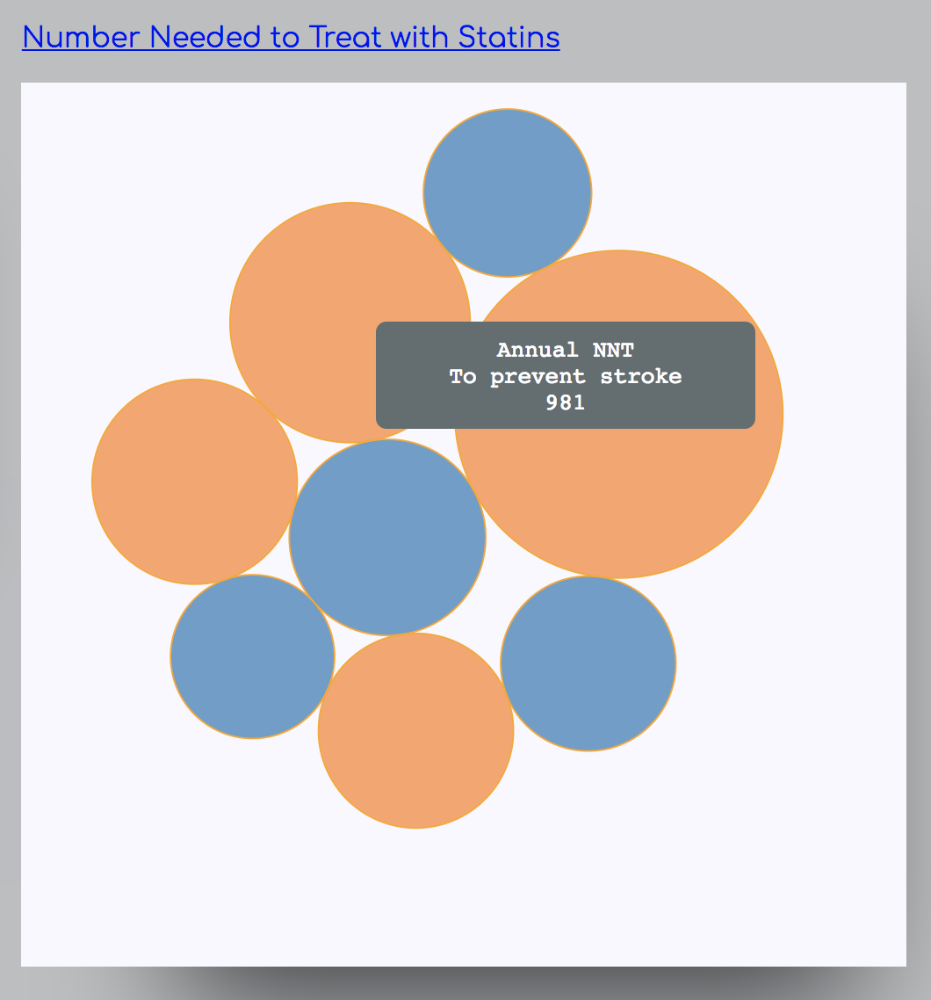
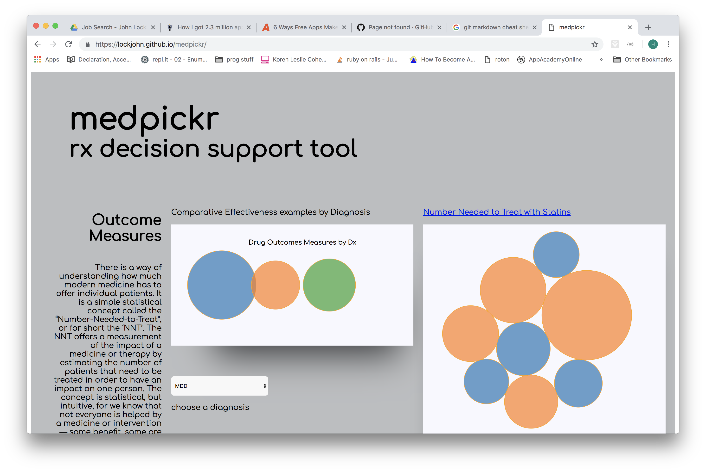

# [Live App](http://lockjohn.github.io/medpickr/)

## medpickr
*A drug data visualization app that supports physician treatment-selection*



### Background and Overview

medpickr is a medical descion support tool that uses data visualization to provide a gestalt synthesis of key drug metrics (NNT, NNH, interactions...) in order to compare drug effectiveness for a given diagnosis.
Currently, key drug informatics are located in data silos: nested under descriptions of individual drugs and depicting information in non-visually distinct data tables using basic numerical representation in small font. This practice makes it difficulty to make quick and effective comparisons during the increasingly smaller amounts of allotted time per clinical encounter, as it inihibits both ease of accessing and gestalt comparision using biostatistical measures.




### Functionality & MVP  
Users can choose a diagnosis and see different drug treatment options
Users can get more information about how each option compares in effectiveness to others by click or hovering
Users can interact with visual representations of the data (click, drag) and implement force features of D3 library

### Architecture and Technologies

This project uses:

- HTML/CSS for content and style of DOM
- D3js for DOM manipulation and dynamic data-driven transformations outputted to SVG objects
- to further expand capabilities will require a database backend to house pharmaceutical data

The project requires:

`index.html`: to house basic canvas layout and following script files:

`dataDisplay.js`: D3 script to provide visualization of data objects

`data.js`: to house prototype data for one example diagnostic class (with future implementation to a backend database)

`styles.css`


### Code Snippet: 
```javascript
d3.select(".circles").append('select')
        .on('change', function () {
            var choice = d3.select('select').property('value')

            if (choice === "MDD") {
                dxChoice = firstDataSet;
            } else if (choice === "AFib") {
                dxChoice = secDataSet;
            } else {
                dxChoice = thirdDataSet;
            }
            console.log(dxChoice);
            console.log(d3.min(dxChoice));
            //need to iterate through whole dxChoice for a set of all the m1s... 
            var data = function (dxChoice) {
                return dxChoice.map(dx => dx.m1)
            }
            var dataArray = data(dxChoice);
            console.log(d3.min(dataArray));
            console.log(d3.max(dataArray));
            var scaleRadius = d3.scaleLinear().domain([d3.min(dataArray), d3.max(dataArray)]).range([20, 60])
            // console.log(scaleRadius());

            circle = svgDoc.select("g").selectAll("circle")
                .data(dxChoice);

            circle.exit().remove();
            circle.enter().append("circle")
                .attr("r", 0);

            svgDoc.select("g").selectAll("circle")
                .data(dxChoice).transition()
                .duration(500)
                .attr("cx", function (d, i) {

                    var spacing = lineLength / (dxChoice.length);
                    return xBuffer + (i * spacing)
                })
                .attr("cy", yBuffer)
                .attr("r", function (d, i) {
                    console.log(scaleRadius(d.m1));

                    return scaleRadius(d.m1)
                })
                .attr("fill", function (d, i) { return color(Math.floor(Math.random() * 11)) });


        })
        .selectAll('option')
        .data(dataSet) //bind options to the three members of dataset
        .enter()
        .append('option')
        .attr('value', function (d) {
            return d[0].tag
        })
        .text(function (d) {
            return d[0].tag
        });

```

### Follow-up features

- [ ] Create Node.js back-end database to access more drug information
- [ ] Include more dynamic data driven relative comparisons
 
